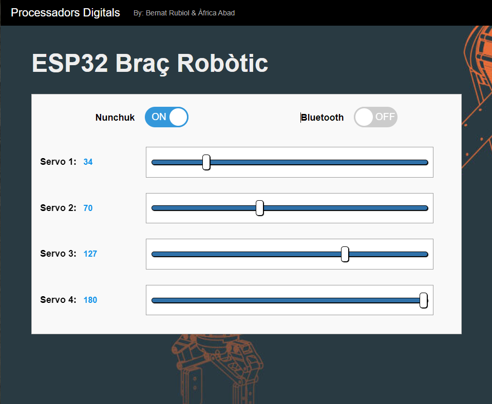
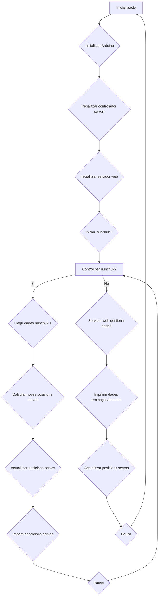
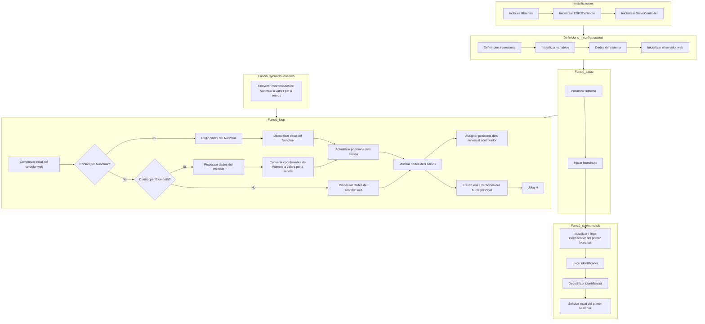

# Projecte final PD
Alumnes: **Àfrica Abad i Bernat Rubiol**

El nostre projecte consisteix en desenvolupar un programa per controlar un robot mitjançant un nunchuk o a través d'una interfície web. Amb aquesta combinació de controls, el nostre projecte proporciona una experiència d'interacció completa i flexible amb el robot.

## Objectiu

Crear una interfície de control pel nostre robot, utilitzant el nunchuk i una web com a dispositiu d'entrada.

## Informe

Connexions servo:

Conexions nunchuk:

Braç robòtic:

Problemes amb la connexió del segon nunchuck:

## Diagrama de flux

(el farem quan acabem el `main.cpp`)

## Procediment

El nostre professor Manuel ens va dona el braç robòtic a mig montar. Acabar de montar-lo no va ser un problema.

Vam tenir la sort que vam trobar projectes similars al nostre per internet que també comptaven d'un nunchuk, però nosaltres com que tenim 4 servos per comptes de dos, necessitavem dos nunchuks per poder-los controlar tots.

Per a la incorporació del segon nunchuk si que vam tenir més dificultats i molts errors. 

Quan el projecte ja estava casi acabat, el nostre professor ens va proposar de fer la incorporació de la placa ESP32 a la base del braç robòtic per tal que quedés més net i ordenat. Així que això vam fer.

    (posar foto de nosaltres)

## Ventatges i deventatges 

## Funcionament del codi

# Diagrama de codi

## Incloure llibreries i inicialitzacions
- Incloure llibreries
  - `<Arduino.h>`
  - `"ServoController.cpp"`
  - `"MyWebServer.cpp"`
  - `"wii_i2c.h"`
  - `"ESP32Wiimote.h"`
- Inicialitzar ESP32Wiimote
  - `ESP32Wiimote wiimote;`
- Inicialitzar ServoController amb els pins dels servos
  - `ServoController servoController(12, 13, 14, 15);`

## Definicions i configuracions
- Definir pins i constants
  - `#define PIN_SDA_1 21` (data Nunchuk 1)
  - `#define PIN_SCL_1 22` (Clock Nunchuk 1)
  - `#define WII_I2C_PORT 0`
- Inicialitzar variables
  - `unsigned int controller_type_1 = 0;`
  - `unsigned int controller_type_2 = 0;`
- Dades del sistema
  - `SDades dades;`
- Inicialitzar el servidor web
  - `MyWebServer webServer("MOVISTAR_6B6C", "592X7x5ySxb222FTr7uU");`

## Funció `startnunchuk()`
- Inicialitzar i llegir identificador del primer Nunchuk
  - `wii_i2c_init(WII_I2C_PORT, PIN_SDA_1, PIN_SCL_1)`
  - Llegir identificador
  - Decodificar identificador
  - Solicitar estat del primer Nunchuk

## Funció `setup()`
- Inicialitzar sistema
  - `Serial.begin(115200);`
  - `wiimote.init();`
  - `servoController.setup();`
  - `servoController.attachServos();`
  - `webServer.begin();`
- Iniciar Nunchuks
  - `startnunchuk();`

## Funció `xynunchuktoservo(int x, int y, float &retx, float &rety)`
- Convertir coordenades de Nunchuk a valors per a servos

## Funció `loop()`
- Comprovar estat del servidor web
  - Si està activat el control per Nunchuk
    - Llegir dades del Nunchuk
    - Decodificar estat del Nunchuk
    - Actualitzar posicions dels servos
    - Mostrar dades dels servos
    - Assignar posicions dels servos al controlador
  - Si està activat el control per Bluetooth
    - Processar dades del Wiimote
    - Convertir coordenades de Wiimote a valors per a servos
    - Actualitzar posicions dels servos
    - Mostrar dades dels servos
    - Assignar posicions dels servos al controlador
  - Si no es fa servir control per Nunchuk ni per Bluetooth
    - Processar dades del servidor web
    - Mostrar dades dels servos
    - Assignar posicions dels servos al controlador
- Pausa entre iteracions del bucle principal
  - `delay(4);`

# Grafic 2

