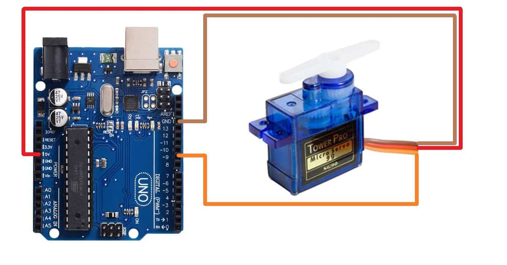

# Projecte final PD
Alumnes: **Àfrica Abad i Bernat Rubiol**

El nostre projecte consisteix en desenvolupar un programa per controlar un robot mitjançant un nunchuk o a través d'una interfície web. Amb aquesta combinació de controls, el nostre projecte proporciona una experiència d'interacció completa i flexible amb el robot.

## Objectiu

Crear una interfície de control pel nostre robot, utilitzant el nunchuk i una web com a dispositiu d'entrada.

## Informe

Connexions servo:

Conexions nunchuk:

Braç robòtic:

## Diagrama de flux

(el farem quan acabem el `main.cpp`)

## Procediment

El nostre professor Manuel ens va dona el braç robòtic a mig montar. Acabar de montar-lo no va ser un problema.

Vam tenir la sort que vam trobar projectes similars al nostre per internet que també comptaven d'un nunchuk, però nosaltres com que tenim 3 servos per comptes de dos, necessitavem dos nunchuks per poder-los controlar tots.

Per a la incorporació del segon nunchuk si que vam tenir més dificultats i molts errors. 

Quan el projecte ja estava casi acabat, el nostre professor ens va proposar de fer la incorporació de la placa ESP32 a la base del braç robòtic per tal que quedés més net i ordenat. Així que això vam fer.

    (posar foto de nosaltres)

## Ventatges i deventatges 