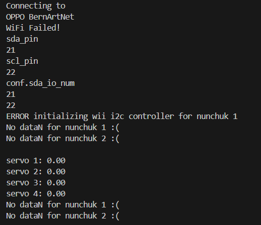

# Projecte final PD
Alumnes: **Àfrica Abad i Bernat Rubiol**

Professor: **Manuel Lopez Palma**

El nostre projecte consisteix en desenvolupar un programa per controlar un braç robòtic mitjançant un nunchuk, comandament wii o a través d'una interfície web (creada per nosaltres). Amb aquesta combinació de controls, el nostre projecte proporciona una experiència d'interacció completa i flexible amb el robot.

  

## Objectiu

Crear una interfície de control pel nostre braç robòtic, utilitzant el nunchuk, el comandament Wii o una web com a dispositiu d'entrada.

## Informe

Connexions servo:

Cada servo té 3 cables:
| Color  | PIN   |
|-------------|-------------|
| Marró | GND |
| Vermell | 5V |
| Taronja | PIN indicat main.cpp |

main.cpp

    ServoController servoController(12,13,14,15);

**Assignació de pins per als servos**

En la implementació del controlador de servos, hem definit els pins per als servos de la següent manera:

| PIN  | Servo   |
|-------------|-------------|
| 12 | 1 |
| 13 | 2 |
| 14 | 3 |
| 15 | 4 |

Conexions Nunchuk:

Bus de comunicació utilitzat pel nunchuk és el I2C, un bus serie sincron. 

El I2C és utilitzat per establir la comunicació entre l'ESP32  i el Nunchuk. 
En el nostre projecte la ESP32 actua com a "master" del bus ja que és el dispositiu que inicialitza la comunicació i llegeix les dades del nunchuk.
El nunchuk és el que actua com a “esclau” perquè respon als comandaments de la ESP32 i proporciona les seves dades quan el master li demana.

Durant el desenvolupament del projecte, es va intentar connectar dos nunchuks amb l'objectiu de controlar els quatre servos. No obstant això, l'intent de connexió del segon nunchuk va resultar ser infructuós. Es van presentar nombrosos errors que no es van poder resoldre malgrat múltiples intents i diverses configuracions.

Després d'analitzar diverses alternatives i intentar solucionar els problemes sense èxit, es va prendre la decisió d'utilitzar el comandament de Wii com a dispositiu auxiliar. Aquesta solució va permetre integrar la funcionalitat Bluetooth en el projecte, proporcionant una interfície de control addicional i millorant la connectivitat global del sistema.

La nostra web:

## Procediment

El nostre professor Manuel ens va dona el braç robòtic a mig montar. Acabar de montar-lo no va ser un problema.

Durant el desenvolupament del projecte, vam tenir la sort de trobar projectes similars al nostre a internet que també utilitzaven un nunchuk per al control. No obstant això, com que el nostre projecte requeriria el control de quatre servos en lloc de dos, vam haver d'idear una solució innovadora per adaptar aquests exemples a les nostres necessitats específiques.

Aquesta adaptació va implicar dissenyar un esquema de control que permetés gestionar els quatre servos de manera eficient, garantint la precisió i la resposta adequada de cada component. Això va requerir ajustar el codi de control i la configuració del hardware per assegurar una funcionalitat òptima i una comunicació sense errors entre els dispositius.

Quan el projecte ja estava casi acabat, el nostre professor ens va proposar de fer la incorporació de la placa ESP32 a la base del braç robòtic per tal que quedés més net i ordenat. Així que això vam fer.

|  |  |
|-----------------------------|-----------------------------|

# Diagrama de codi

## Incloure llibreries i inicialitzacions
- Incloure llibreries
  - `<Arduino.h>`
  - `"ServoController.cpp"`
  - `"MyWebServer.cpp"`
  - `"wii_i2c.h"`
  - `"ESP32Wiimote.h"`
- Inicialitzar ESP32Wiimote
  - `ESP32Wiimote wiimote;`
- Inicialitzar ServoController amb els pins dels servos
  - `ServoController servoController(12, 13, 14, 15);`

## Definicions i configuracions
- Definir pins i constants
  - `#define PIN_SDA_1 21` (data Nunchuk 1)
  - `#define PIN_SCL_1 22` (Clock Nunchuk 1)
  - `#define WII_I2C_PORT 0`
- Inicialitzar variables
  - `unsigned int controller_type_1 = 0;`
  - `unsigned int controller_type_2 = 0;`
- Dades del sistema
  - `SDades dades;`
- Inicialitzar el servidor web
  - `MyWebServer webServer("MOVISTAR_6B6C", "592X7x5ySxb222FTr7uU");`

## Funció `startnunchuk()`
- Inicialitzar i llegir identificador del primer Nunchuk
  - `wii_i2c_init(WII_I2C_PORT, PIN_SDA_1, PIN_SCL_1)`
  - Llegir identificador
  - Decodificar identificador
  - Solicitar estat del primer Nunchuk

## Funció `setup()`
- Inicialitzar sistema
  - `Serial.begin(115200);`
  - `wiimote.init();`
  - `servoController.setup();`
  - `servoController.attachServos();`
  - `webServer.begin();`
- Iniciar Nunchuks
  - `startnunchuk();`

## Funció `xynunchuktoservo(int x, int y, float &retx, float &rety)`
- Convertir coordenades de Nunchuk a valors per a servos

## Funció `loop()`
- Comprovar estat del servidor web
  - Si està activat el control per Nunchuk
    - Llegir dades del Nunchuk
    - Decodificar estat del Nunchuk
    - Actualitzar posicions dels servos
    - Mostrar dades dels servos
    - Assignar posicions dels servos al controlador
  - Si està activat el control per Bluetooth
    - Processar dades del Wiimote
    - Convertir coordenades de Wiimote a valors per a servos
    - Actualitzar posicions dels servos
    - Mostrar dades dels servos
    - Assignar posicions dels servos al controlador
  - Si no es fa servir control per Nunchuk ni per Bluetooth
    - Processar dades del servidor web
    - Mostrar dades dels servos
    - Assignar posicions dels servos al controlador
- Pausa entre iteracions del bucle principal
  - `delay(4);`

# Diagrama de flux

